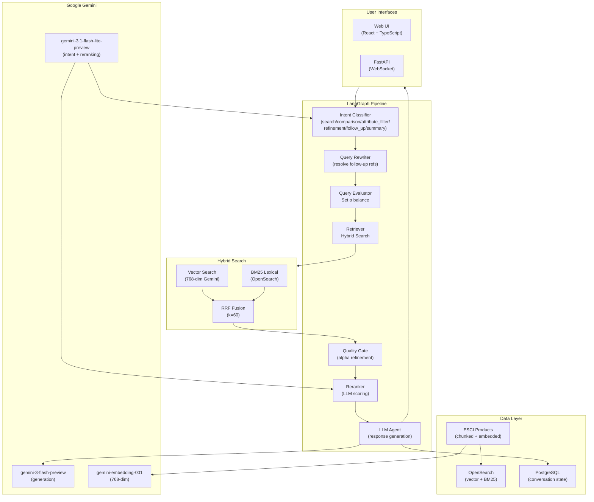

# Agentic Hybrid Search

A production-grade **LangGraph RAG agent** for Amazon ESCI e-commerce product search
with hybrid search (vector + BM25), LLM-based reranking, intent routing, and
real-time streaming. Deployed on **GCP Cloud Run** with Google Gemini AI.

## Quick Start

### Local Development

```bash
cd langchain_agent
./scripts/setup.sh    # One-time setup (10-20 min)
./scripts/start.sh    # Start backend + frontend → http://localhost:5173
```

### Cloud Deployment (GCP)

```bash
cd langchain_agent
./scripts/deploy.sh --project <GCP_PROJECT_ID>
```

Deploys to Cloud Run with Cloud SQL (PostgreSQL), OpenSearch (document search),
Secret Manager, and Artifact Registry. Scales to zero when idle.

## What is It?

A conversational RAG agent powered by Google Gemini AI for e-commerce product discovery:

- **Product Search** - Hybrid search combining vector embeddings + full-text (BM25)
- **Intent Classification** - 6 intents (search, comparison, attribute_filter, refinement, follow_up, summary) with keyword fast-path + LLM fallback
- **LangGraph Pipeline** - Deterministic graph-based orchestration with dynamic alpha refinement
- **Hybrid Search** - Vector + full-text search with Reciprocal Rank Fusion (RRF, k=60)
- **LLM-Based Reranking** - Gemini Flash Lite reranker for relevance scoring (0.0-1.0)
- **Dynamic Alpha** - Query-aware lexical/semantic balance (α = 0.0 pure lexical, 1.0 pure semantic)
- **Alpha Refinement** - If max score < 0.5, retries with opposite search strategy
- **Real-Time Streaming** - Token-by-token output via WebSocket with cancellation support
- **Observability Panel** - Live visualization of intent classification, search scores, reranking results
- **ESCI Data** - 1.8M+ Amazon product listings with deterministic sampling for reproducibility

## Architecture

### System Overview



### Agent Pipeline Flow

```text
intent_classifier
  ├── question         → query_rewriter → query_evaluator (set α) → retriever (hybrid search) → alpha_refiner → reranker → agent
  ├── summary          → summarize conversation history → agent response
  └── follow_up        → query_rewriter (resolve refs) → query_evaluator → retriever → alpha_refiner → reranker → agent

Key Decision Points:
  - Query Rewriter: Resolves pronouns, comparatives, and attribute questions using conversation context
  - Query Evaluator: Classifies query type and sets optimal α (0.0-1.0) using e-commerce-tuned guide
  - Alpha Refiner: If max relevance < 0.5, retry with opposite strategy (lexical → semantic or vice versa)
  - Reranker: LLM-based scoring of top-K documents (0.0-1.0 relevance)
  - Citations: Products cited with Amazon URLs derived from ASIN metadata
```

### Search Balance (Alpha Parameter)

The Query Evaluator dynamically sets `α` based on query characteristics:

| α Range | Strategy | Best For |
|---------|----------|----------|
| 0.0-0.2 | Pure Lexical | Brand names, product IDs, specific models |
| 0.2-0.4 | Lexical-Heavy | Specific attributes, colors, materials |
| 0.4-0.6 | Balanced | Feature combinations ("wireless AND blue") |
| 0.6-0.8 | Semantic-Heavy | Use-case queries ("headphones for running") |
| 0.8-1.0 | Pure Semantic | Conceptual queries ("best outdoor gear") |

If initial search scores are low (max < 0.5), Alpha Refiner automatically
retries with opposite strategy to ensure good results.

## Tech Stack

| Category | Technology | Purpose |
|----------|-----------|---------|
| **LLM** | Google Gemini 3 Flash | Response generation |
| **Intent Classifier** | Gemini 3.1 Flash Lite | Intent detection (question/summary/follow_up) |
| **Reranker** | Gemini 3.1 Flash Lite | LLM-based relevance scoring (0.0-1.0) |
| **Embeddings** | Gemini Embedding 001 | 768-dimensional product chunk vectors |
| **Vector Database** | OpenSearch 2.19.1 | HNSW knn_vector index + BM25 lexical |
| **Search Algorithm** | Reciprocal Rank Fusion | Hybrid fusion of vector + lexical scores |
| **Checkpoints** | PostgreSQL 16 | LangGraph state checkpoints + conversation history |
| **Agent Framework** | LangGraph + LangChain | Graph-based pipeline with typed state |
| **Backend API** | FastAPI + WebSocket | REST/WebSocket with real-time streaming |
| **Frontend** | React 18 + TypeScript + Tailwind | Web UI with Zustand state management |
| **Data Source** | ESCI Dataset | 1.8M+ Amazon product listings (parquet) |
| **Deployment** | GCP Cloud Run | Serverless auto-scaling container |
| **Containerization** | Docker (multi-stage) | Frontend (Node) + Backend (Python) build |

## Example Queries

**Product Search** (question intent):

```text
Find me wireless headphones under $100
Show me blue running shoes for women
What waterproof backpacks do you have?
```

**Refinement** (refinement intent - add constraint to prior search results with context validation):

Refinement queries intelligently narrow previous search results by applying new constraints, while detecting context switches between different product categories.

```text
SAME CATEGORY (Refinement):
"Find me boots" → Intent: search, retrieves 30 boots
"They should also be waterproof"  → Intent: refinement (category continuity: 1.0)
                                    Filters to waterproof boots from prior search ONLY
                                    Alpha: 0.35 (lexical-heavy for attribute matching)
                                    Response: "From the 30 boots I showed you earlier, here are the waterproof options..."

DIFFERENT CATEGORY (New Search):
"Find me boots" → Intent: search, retrieves 30 boots
"Find me red dresses" → Intent: search (category continuity: 0.0, boots ≠ dresses)
                       NOT treated as refinement - resets context
                       Retrieves red dresses (completely separate from boots)
                       Response: "I found X red dresses matching your search..."

FOLLOW-UP vs REFINEMENT:
"Show me headphones" → Intent: search
"Any cheaper ones?" → Intent: follow_up (vague expansion)
                      Expanded: "Any cheaper noise-cancelling headphones?"
```

**Context Validation Algorithm:**

The system validates refinement intents using a 4-step process:

1. **Category Matching** (Weighted: 100%)
   - Extracts inferred category from prior search documents (e.g., "boots", "dresses", "headphones")
   - Extracts category from current query using pattern matching (e.g., "boots", "waterproof boots")
   - Exact category match (e.g., boots → boots) = 1.0 score
   - Related categories (e.g., boots → shoes) = 0.7 score
   - Different categories (e.g., boots → dresses) = 0.0 score

2. **Document ID Overlap** (Weighted: 50%)
   - Calculates % of prior product IDs still in new results
   - High overlap (>50%) indicates same category = weighted toward 1.0
   - Low overlap (<10%) indicates different category = weighted toward 0.0

3. **Continuity Score Calculation**
   - Averages category match + document overlap
   - Score > 0.7: Strong continuity → Treat as refinement ✓
   - Score 0.3-0.7: Ambiguous → Lower confidence, may request clarification ⚠️
   - Score < 0.3: Different categories → Treat as new search ✓

4. **Intent Adjustment**
   - Score > 0.7: Proceed with refinement intent (alpha=0.35)
   - Score 0.3-0.7: Lower confidence below 0.7 → triggers clarification intent ⚠️
   - Score < 0.3: Downgrade to search intent, reset prior_search_documents

**Explicit Context Feedback:**

When refinement is detected and confirmed, the agent response explicitly states the context:

```text
Response format: "From the [N] [category] I showed you earlier, here are the ones that match your new criteria:
- Product A (meets waterproof constraint) ✓
- Product B (meets waterproof constraint) ✓
- Notably, Product C from my earlier recommendations also meets this requirement ✓
"
```

This explicit confirmation ensures users understand what's being refined and why certain products appear.

**Multi-Sequence Conversation Example:**

```text
Turn 1: User: "Find me boots"
        Response: "I found 50 boots matching your search..."
        State: prior_search_documents=[50 boots], prior_category="boots"

Turn 2: User: "Make them waterproof"
        Intent classification: refinement (category="boots", continuity=1.0)
        Response: "From the 50 boots I showed earlier, here are the waterproof options..."
        State: prior_search_documents=[50 boots], prior_category="boots"

Turn 3: User: "Find me red dresses"
        Intent classification: search (category="dresses", continuity=0.0 < 0.3)
        Context reset: prior_search_documents cleared, starting fresh search
        Response: "I found 30 red dresses matching your search..."
        State: prior_search_documents=[30 dresses], prior_category="dresses"

Turn 4: User: "Casual ones"
        Intent classification: refinement (category="dresses", continuity=1.0)
        Response: "From the 30 red dresses I showed earlier, here are the casual options..."
        State: prior_search_documents=[30 dresses], prior_category="dresses"
```

**Edge Case Handling:**

| Scenario | Detected | Action |
|----------|----------|--------|
| boots → "waterproof" (vague) | Ambiguous (0.5 continuity) | Request clarification: "Did you mean waterproof boots or a different product?" |
| boots → "Find me dresses" | Different category (0.0) | Reset context, treat as new search ✓ |
| boots → "dresses" (alone) | Follow-up (0.0) or Search (0.95) | Downgraded from refinement, treated as new search ✓ |
| boots → "Also in brown" | Refinement (1.0) | Refine to brown boots from prior 30 ✓ |
| Multiple categories in one query | Ambiguous | Lower confidence to 0.65 → request clarification ⚠️ |

**Attribute Filter** (standalone filtered search):

```text
"Show me waterproof boots"        → Intent: attribute_filter (specific attributes, no prior search)
"Blue running shoes size 10"      → Intent: attribute_filter (specific constraints)
```

**Conversation Summary** (summary intent):

```text
Summarize what we've discussed so far
```

**Search Strategy Adaptation**:

The agent automatically adjusts search strategy based on query:
- `"Samsung Galaxy S21"` → lexical focus (α=0.1) for brand/model matching
- `"phone for outdoor photography"` → semantic focus (α=0.8) for use-case understanding
- If results are poor, Alpha Refiner retries with opposite strategy

## Observability Panel

The web UI includes a real-time observability panel showing each pipeline stage:

- **Intent Classification** - Detected intent with confidence score and keyword/LLM path
- **Query Evaluation** - Assigned α value (lexical/semantic balance) and reasoning
- **Hybrid Search** - Vector scores, BM25 scores, RRF fusion results
- **Alpha Refinement** - Shows if retry occurred (due to low max score < 0.5)
- **Reranker Results** - Per-document relevance scores (0.0-1.0) and top-K selection
- **LLM Generation** - Token-by-token output streaming with timing metrics
- **Timing Breakdown** - Latency per pipeline node (search, reranking, generation)
- **Execution Status** - Running/complete/skipped indicators for each node

Developers can inspect intermediate search scores, reranking decisions, and
reason about why certain products were ranked higher than others.

## Key Techniques

| Technique | Description |
|-----------|-------------|
| **Intent Classification** | 6-intent detection (search/comparison/attribute_filter/refinement/follow_up/summary) with keyword fast-path + LLM fallback |
| **Conversational Query Rewriting** | Resolves pronouns ("it", "those"), comparatives ("which is cheaper"), and attribute questions ("how much?") using conversation context |
| **Refinement Intent** | When user adds constraints to prior search, filters retrieval to prior product IDs then applies new attribute filters. Ensures "make them X" narrows results instead of searching independently |
| **Context Continuity Validation** | Validates refinement queries using product category matching + document overlap scoring. Distinguishes between "waterproof boots" (refinement of boots search) vs "Find me dresses" (new search). Auto-resets context when categories differ |
| **Explicit Context Feedback** | Agent responses explicitly reference prior search: "From the 30 boots I showed earlier, here are the waterproof options..." Improves user confidence in refinement detection and clarifies applied constraints |
| **Dynamic Alpha** | Fast-path alpha for attribute_filter (0.25), comparison (0.60), refinement (0.35). LLM path for search/follow_up. Analyzes query type for optimal lexical/semantic balance (0.0-1.0) |
| **Reciprocal Rank Fusion** | Fuses vector + BM25 rankings: `score = Σ 1/(rank + k)` where k=60 |
| **LLM-Based Reranking** | Gemini Flash Lite scores query-product relevance on 0.0-1.0 scale |
| **Alpha Refinement** | If max reranker score < 0.5, automatically retries with opposite search strategy |
| **Embedding Cache** | Caches query embeddings (60-min TTL) to reduce embedding API calls |
| **Deterministic Sampling** | ESCI products sampled with `random_state=42` for reproducibility across runs |
| **Idempotent Ingestion** | Cached sample parquets ensure product dataset ingestion is deterministic and fast on re-runs |
| **Streaming Responses** | WebSocket token-by-token generation with cancellation support |
| **Observability Events** | Real-time Pydantic-typed events for search, reranking, and generation stages |

## Directory Structure

```text
agentic-hybrid-search/
├── README.md                     # This file
├── docker-compose.yml            # PostgreSQL + OpenSearch (local dev)
├── langchain_agent/
│   ├── scripts/
│   │   ├── setup.sh              # One-time: Docker + venv + DB init + ingestion
│   │   ├── start.sh              # Start backend + frontend
│   │   ├── stop.sh               # Stop all services
│   │   ├── deploy.sh             # GCP Cloud Run deployment
│   │   ├── gcp-init.sh           # Cloud SQL + product ingestion (one-time)
│   │   ├── gcp-teardown.sh       # Remove all GCP resources
│   │   └── teardown.sh           # Full local cleanup
│   ├── api/                      # FastAPI backend
│   │   ├── main.py               # API routes + WebSocket
│   │   ├── schemas/events.py     # Observable event models
│   │   └── services/             # Observable agent wrapper
│   ├── web/                      # React frontend
│   │   └── src/components/
│   │       └── ObservabilityPanel/  # Real-time pipeline visualization
│   ├── main.py                   # LangGraph agent (EcommerceSearchAgent)
│   ├── config.py                 # Configuration constants (ESCI-focused)
│   ├── vector_store.py           # Hybrid search + RRF fusion
│   ├── reranker.py               # LLM-based relevance scoring
│   ├── agent_state.py            # LangGraph CustomAgentState TypedDict
│   ├── setup.py                  # Database initialization
│   ├── ingest_esci_products.py   # ESCI product ingestion (deterministic sampling)
│   ├── embedding_cache.py        # Query embedding cache
│   ├── link_verifier.py          # URL validation with TTL cache
│   ├── Dockerfile                # Multi-stage build (Node + Python)
│   └── tests/                    # pytest suites (unit, integration, e2e)
├── esci/                         # Amazon ESCI dataset (gitignored, local only)
│   └── shopping_queries_dataset/
│       └── shopping_queries_dataset_products.parquet  # 1.8M+ products
└── web/                          # Skeleton web app (less developed)
```

## Search Optimization

### Hybrid Search Strategy

Products are indexed with both vector embeddings and lexical (BM25) tokens:

- **Vector Search**: 768-dim Gemini embeddings capture semantic meaning
  - Best for: "phone for hiking", "comfortable work shoes"
  - Fast: ~200-500ms via HNSW index

- **Lexical Search**: BM25 tokenization captures exact matches
  - Best for: "Samsung Galaxy", "Nike Air Max", "color:blue"
  - Fast: ~100-300ms via Lucene analyzer

- **RRF Fusion**: Reciprocal Rank Fusion (k=60) combines both
  - Normalizes scores from both methods
  - Formula: `score = Σ 1/(rank + 60)` for each result
  - Balances precision + recall

### Dynamic Alpha Refinement

If top-result relevance < 0.5 after reranking, the Alpha Refiner automatically
retries the opposite search strategy (vector ↔ lexical) to ensure good results.

### Configurable Parameters

```bash
# In langchain_agent/.env
RRF_K=60                           # RRF constant (higher = less dominance of rank 1)
ENABLE_EMBEDDING_CACHE=true        # Cache query embeddings (default: true)
EMBEDDING_CACHE_MAX_SIZE=100       # Max cached embeddings
ESCI_INGEST_LIMIT=10000           # Default product sample size
```

## Deployment

### GCP Cloud Run

The `deploy.sh` script handles production deployment:

1. Enables GCP APIs (Cloud Run, SQL, Artifact Registry, Secret Manager)
2. Creates Cloud SQL PostgreSQL instance (conversation checkpoints)
3. Stores secrets in Secret Manager (GOOGLE_API_KEY, API_KEY, OpenSearch credentials)
4. Builds multi-stage Docker image (React frontend + Python backend)
5. Pushes to Artifact Registry
6. Deploys to Cloud Run with Cloud SQL proxy

**Cost Optimization**:

- `min-instances=0` — scales to zero when idle (no ongoing charges)
- `max-instances=2` — prevents runaway scaling
- CPU throttling — CPU only allocated during request processing
- Cloud SQL `db-f1-micro` tier — minimal checkpoint storage

```bash
# First deployment
./scripts/deploy.sh --project <PROJECT_ID>

# One-time: Initialize Cloud SQL + ingest ESCI products to OpenSearch
./scripts/gcp-init.sh --project <PROJECT_ID>

# View logs
gcloud logging read resource.type=cloud_run_revision --project=<PROJECT_ID>

# Teardown all GCP resources
./scripts/gcp-teardown.sh --project <PROJECT_ID>
```

**OpenSearch**: Hosted externally on GCP VM (34.138.97.13:9200). Credentials stored
in Secret Manager as `agentic-hybrid-search-opensearch-user/password`.

### Local Development

```bash
cd langchain_agent
cp .env.example .env        # Edit .env with GOOGLE_API_KEY and API_KEY
./scripts/setup.sh         # One-time: Docker + venv + DB + product ingestion
./scripts/start.sh         # Start backend (8000) + frontend (5173)
./scripts/stop.sh          # Stop services
./scripts/teardown.sh      # Full cleanup (containers, venv, data)
```

**Prerequisites**:
- Docker Desktop
- Python 3.13+
- Node.js 18+
- Google API Key ([get here](https://aistudio.google.com/apikey))
- ~1GB disk space for ESCI dataset (local development)


## Performance

| Operation | Time |
|-----------|------|
| Product Search (end-to-end) | 6-15s |
| Vector search (768-dim, HNSW) | ~200-500ms |
| BM25 lexical search | ~100-300ms |
| RRF fusion + reranking | ~1-2s |
| Query embedding (cached) | ~50ms (cached), ~500ms (fresh) |
| Alpha evaluation | ~300-500ms |
| LLM response generation (streaming) | ~3-8s |
| Alpha Refinement (full retry) | +1-2s if triggered |

**Typical Flow**:
1. Embedding + RRF fusion: ~600-700ms
2. Reranking top-40 products: ~1-2s
3. LLM generation: ~3-8s
4. Total: ~5-12s for typical query

**Cached queries** (within 1-hour window): ~2-3s faster due to embedding cache

---

**Status**: Production Deployed on GCP Cloud Run
