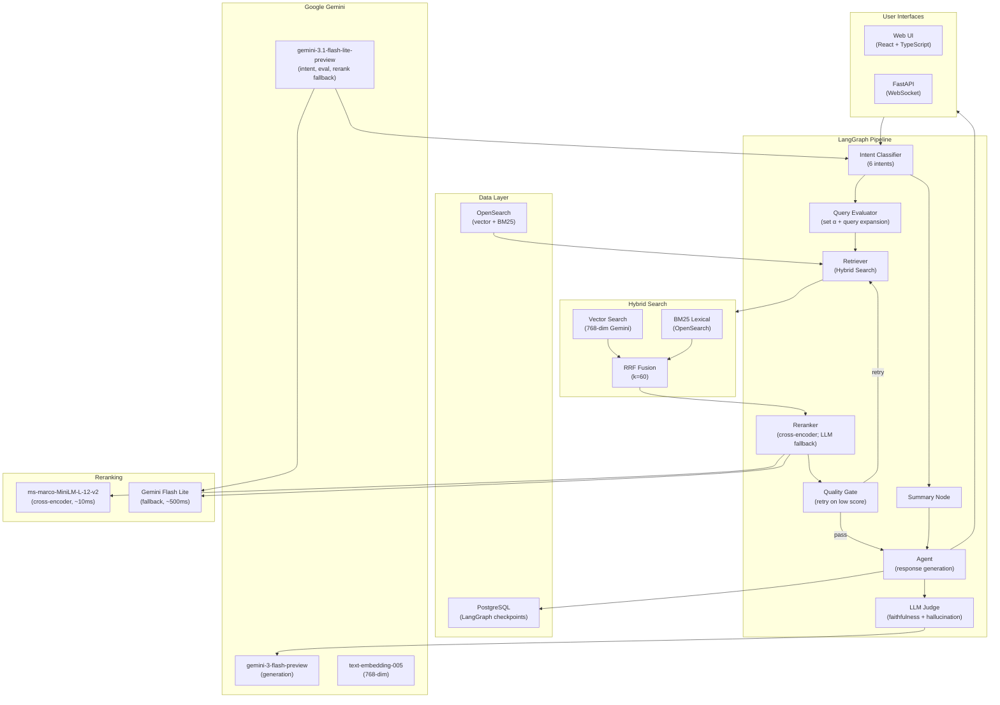

# Agentic Hybrid Search

> Other docs: [langchain_agent/README.md](langchain_agent/README.md) ·
> [tests/README.md](langchain_agent/tests/README.md) ·
> [tests/e2e/README.md](langchain_agent/tests/e2e/README.md)

A production-grade **LangGraph RAG agent** for Amazon ESCI e-commerce product search.
Combines hybrid retrieval (vector + BM25 via RRF), LLM-based reranking, intent
routing, and real-time WebSocket streaming. Deployed on
**GCP Cloud Run** with Google Gemini.

## Quick Start

### Local Development

```bash
cd langchain_agent
./scripts/setup.sh    # One-time setup (10–20 min)
./scripts/start.sh    # Start backend + frontend → http://localhost:5173
```

### Cloud Deployment (GCP)

```bash
cd langchain_agent
./scripts/deploy.sh --project <GCP_PROJECT_ID>
```

Deploys to Cloud Run with Cloud SQL (PostgreSQL checkpoints), an externally
hosted OpenSearch cluster, Secret Manager, and Artifact Registry. Scales to
zero when idle.

## What It Does

A conversational RAG agent powered by Google Gemini for e-commerce product discovery:

- **6-intent classifier** — `search`, `comparison`, `attribute_filter`,
  `refinement`, `follow_up`, `summary` — keyword fast-path + LLM fallback
- **Hybrid search** — vector (768-dim Gemini embeddings) + BM25 lexical,
  fused via Reciprocal Rank Fusion (k=60)
- **Cross-encoder reranking** — `ms-marco-MiniLM-L-12-v2` scores
  query-product relevance (~10ms); Gemini Flash Lite fallback (~500ms)
- **Dynamic alpha** — query-aware lexical/semantic balance; fast-path alpha
  for comparison/attribute_filter/refinement, LLM path for search/follow_up
- **Quality gate** — if max reranker score < 0.5, adjusts alpha ±0.3 and
  retries once
- **Conversational query rewriting** — resolves pronouns, comparatives, and
  short attribute questions using conversation history
- **Refinement with context validation** — "make them waterproof" narrows
  the prior result set; category/document-overlap scoring resets context
  when the user pivots
- **Typeahead autocomplete** — `GET /api/suggest` edge-ngram prefix matching
  on product titles + brands with spell correction (Levenshtein +
  SequenceMatcher), fuzzy fallback for single-character typos, and a
  three-section UI (Did you mean? / Suggestions / Recent Searches)
- **Admin reindex API** — `GET /api/admin/reindex` triggers a background
  ESCI re-ingestion; `GET /api/admin/reindex/status` polls progress;
  `GET /api/admin/health` reports index health and doc count. Requires
  session auth (UI login) or `X-Admin-Token` header (GitHub Actions
  automation)
- **BM25 lexical optimizations** — synonym expansion, fuzzy matching, phrase
  boosting, field boosting, and phonetic matching (double_metaphone via the
  `analysis-phonetic` plugin), displayed in the observability panel's
  "Search Optimizations" card
- **Pipeline Quality Summary** — every turn ends with a per-stage scorecard.
  With ESCI ground truth: NDCG@10 / MRR / Recall@20 / Precision@10 across
  BM25 → Hybrid → Reranked, plus a latency cost-benefit table. Without
  ground truth: a self-referential confidence proxy (top-1 score, score gap,
  variance, rank churn) labeled high/medium/low
- **Observability persistence** — clicking a past conversation hydrates the
  observability panel with that turn's last recorded state (intent, alpha,
  reranker score, quality gate verdict, latency breakdown) from the
  LangGraph checkpoint
- **Real-time streaming** — token-by-token WebSocket output with cancellation
- **Observability panel** — live visualization of every pipeline stage

## Architecture

### System Overview



### Pipeline Flow (RAG Q&A Mode)

```text
intent_classifier
  ├── search / comparison / attribute_filter /
  │   refinement / follow_up  → query_evaluator → retriever → reranker → quality_gate → agent → llm_judge
  │                                                                          │
  │                                                                          └── (retry) → retriever
  ├── summary                  → summary → agent → llm_judge
  └── clarify (low confidence) → agent → llm_judge (asks user to disambiguate)
```

Key decision points:

- **Query Evaluator** — classifies query type and sets optimal α (0.0–1.0)
  with an e-commerce-tuned guide. Also expands vague queries (pronouns,
  comparatives, short attribute questions) using conversation context.
- **Quality Gate** — if `reranker_max_score < 0.5` and not yet retried,
  adjusts α ±0.3 and loops back to the retriever; otherwise continues to
  the agent.
- **Reranker** — cross-encoder scoring of top-K documents on a 0.0–1.0
  scale; Gemini Flash Lite fallback with Pydantic-validated output.
- **Citations** — Amazon search URLs derived from product title
  (`https://www.amazon.com/s?k={title}`), deduplicated and filtered by a
  minimum reranker score (0.10). Search-by-title is robust against delisted
  ASINs (the legacy `/dp/{ASIN}` form 404'd frequently).

### Search Balance (Alpha Parameter)

| α Range | Strategy | Best For |
| --- | --- | --- |
| 0.0–0.15 | Pure lexical | Exact model numbers, ASINs, UPCs |
| 0.15–0.40 | Lexical-heavy | Brand + category, specific attributes (color/size) |
| 0.40–0.60 | Balanced | Feature combinations, activity-based queries |
| 0.60–0.75 | Semantic-heavy | Conceptual needs, occasion-based queries |
| 0.75–1.0 | Pure semantic | Gift ideas, mood/style, open-ended exploration |

Fast-path defaults:

| Intent | α | Path |
| --- | --- | --- |
| `comparison` | 0.60 | Fast (keyword) |
| `attribute_filter` | 0.25 | Fast (keyword) |
| `refinement` | 0.35 | Fast (keyword) |
| `search`, `follow_up` | LLM-assigned | LLM path |

If the top reranker score is still below 0.5 after retrieval, the Quality Gate
retries with an opposite-direction α adjustment.

## Tech Stack

| Category | Technology | Purpose |
| --- | --- | --- |
| **LLM (generation)** | Gemini 3 Flash (preview) | Response generation |
| **LLM (classify/eval)** | Gemini 3.1 Flash Lite (preview) | Intent classification, query evaluation, reranking fallback |
| **Document Reranking** | `ms-marco-MiniLM-L-12-v2` (cross-encoder) | Default reranker (~10ms/query); Gemini Flash Lite fallback (~500ms) |
| **Embeddings** | `text-embedding-005` | 768-dim vectors |
| **Vector Database** | OpenSearch 2.19.1 | HNSW `knn_vector` + BM25 |
| **Search Fusion** | Reciprocal Rank Fusion (k=60) | Hybrid score fusion |
| **Checkpoints** | PostgreSQL 16 | LangGraph state persistence |
| **Agent Framework** | LangGraph + LangChain | Graph-based pipeline with typed state |
| **Backend API** | FastAPI + WebSocket | REST/WebSocket with real-time streaming |
| **Frontend** | React 18 + TypeScript + Tailwind + Zustand | Observability panel + chat UI |
| **Data** | Amazon ESCI (Shopping Queries Dataset) | 1.8M+ product listings |
| **Deployment** | GCP Cloud Run (multi-stage Docker) | Serverless auto-scaling |

## Example Queries

**Product Search:**

```text
Find me wireless headphones under $100
Show me blue running shoes for women
What waterproof backpacks do you have?
```

**Refinement — narrows prior results with context validation:**

```text
SAME CATEGORY (refinement):
  "Find me boots"              → intent=search, retrieves 30 boots
  "They should be waterproof"  → intent=refinement (continuity=1.0)
                                 α=0.35, filters waterproof from the prior 30

DIFFERENT CATEGORY (new search):
  "Find me boots"              → intent=search
  "Find me red dresses"        → intent=search (continuity=0.0)
                                 context reset, retrieves dresses fresh
```

**Context Validation:** Continuity score combines category matching and
document-ID overlap. `>0.7` proceeds as refinement; `0.3–0.7` requests
clarification; `<0.3` downgrades to a new search and resets prior context.

**Attribute Filter — standalone filtered search:**

```text
"Show me waterproof boots"        → intent=attribute_filter (α=0.25)
"Blue running shoes size 10"      → intent=attribute_filter
```

**Comparison:**

```text
Compare Sony WH-1000XM5 vs Bose QuietComfort 45
```

**Summary:**

```text
Summarize what we've discussed so far
```

## Observability Panel

The web UI streams typed Pydantic events over WebSocket for every stage:

- **Intent Classification** — detected intent, confidence, keyword vs LLM path
- **Query Evaluation** — assigned α, reasoning, query expansion
  (pronouns/comparatives resolved)
- **OpenSearch Query** — α, intent, applied filters, plus a small "DSL"
  eye-icon that opens a modal with the exact query body the retriever
  sent (hybrid, BM25 baseline, and quality-gate retry are each shown
  separately; embedding vectors are scrubbed for readability)
- **Hybrid Search** — vector + BM25 candidates with scores
- **Reranker** — per-document 0.0–1.0 relevance and top-K selection
- **Quality Gate** — pass / retry / α adjusted
- **LLM Streaming** — token-by-token output with timing
- **Pipeline Quality Summary** — emitted after `AgentCompleteEvent`; renders
  the per-stage scorecard described below

Event schemas live in `langchain_agent/api/schemas/events.py` and must stay
in sync with `langchain_agent/web/src/types/events.ts`.

### Pipeline Quality Summary

The retriever runs hybrid + BM25-only in parallel (a 2-worker
`ThreadPoolExecutor` — opensearch-py releases the GIL during HTTP I/O), so
every turn produces a BM25 baseline ranking, the pre-rerank hybrid
ranking, the post-rerank ranking, and per-stage latencies (`bm25_ms`,
`retriever_ms`, `reranker_ms`).

When ESCI ground truth exists for the query (best-effort lookup against
the `esci_judgments` index — labels mapped E=4.0, S=1.0, C=0.1, I=0.0),
the summary card shows real metrics per stage: **NDCG@10**, **MRR**,
**Recall@20**, **Precision@10**, plus a latency cost-benefit table with a
"Lift / 100ms" column.

When there is no ground truth, the card falls back to a self-referential
**confidence proxy** — top-1 reranker score, score gap (top-1 vs top-2),
score variance, and rank-churn count between hybrid and reranked — bucketed
into `high` / `medium` / `low`.

Pure-Python metric implementations live in
[`langchain_agent/relevancy_metrics.py`](langchain_agent/relevancy_metrics.py)
(no NumPy). Event payload is `PipelineSummaryEvent` in
`api/schemas/events.py`; the UI lives in
`web/src/components/ObservabilityPanel/PipelineSummaryCard.tsx`.

## Key Techniques

| Technique | Description |
| --- | --- |
| **6-intent classification** | Keyword fast-path + LLM fallback for `search`, `comparison`, `attribute_filter`, `refinement`, `follow_up`, `summary` |
| **Conversational query rewriting** | Resolves pronouns, comparatives, short attribute questions using conversation context; skips expansion when a specific brand/product is named |
| **Context-validated refinement** | Continuity scoring (category match + doc-ID overlap) distinguishes "make them waterproof" (refine prior boots) from "find me dresses" (reset) |
| **Dynamic α** | Fast-path α for comparison/attribute_filter/refinement; LLM path for search/follow_up |
| **RRF fusion** | `score = Σ 1/(rank + 60)` combining vector and BM25 rankings |
| **LLM-based reranking** | Gemini Flash Lite scores query-product relevance, Pydantic-validated 0.0–1.0 |
| **Quality gate with α adjustment** | Retries once with α ±0.3 if max reranker score < 0.5 |
| **Embedding cache** | Query embedding cache (60-min TTL) reduces API calls |
| **Deterministic sampling** | ESCI products sampled with `random_state=42` for reproducibility |
| **Idempotent ingestion** | Cached sample parquets (`esci_products_sample_{N}.parquet`) reused on re-runs |
| **Streaming responses** | WebSocket token-by-token generation with cancellation |
| **Link verification** | URLs validated before inclusion in responses; thread-safe 60-min TTL cache |

## Directory Structure

```text
agentic-hybrid-search/
├── README.md                     # This file
├── CLAUDE.md                     # Repo-specific Claude Code guidance
├── docker-compose.yml            # PostgreSQL + OpenSearch (local dev)
├── LICENSE
├── langchain_agent/              # Main application (see its README)
│   ├── main.py                   # LangGraph agent core (~2,600 lines)
│   ├── agent_state.py            # CustomAgentState TypedDict
│   ├── config.py                 # All configuration constants
│   ├── vector_store.py           # OpenSearchVectorStore + retriever (RRF fusion)
│   ├── reranker.py               # CrossEncoderReranker (default, ~10ms) + GeminiReranker (fallback, ~500ms)
│   ├── link_verifier.py          # URL validation w/ TTL cache
│   ├── embedding_cache.py        # Query embedding cache
│   ├── ingest_esci_products.py   # ESCI product ingestion (deterministic sampling)
│   ├── ingest_esci_judgments.py  # ESCI relevance judgments → esci_judgments index
│   ├── relevancy_metrics.py      # NDCG/MRR/Recall/Precision + confidence proxy (no NumPy)
│   ├── bigquery_batch_embeddings.py  # Parallel embedding via BigQuery ML
│   ├── generate_embeddings.py    # Serial embedding fallback
│   ├── benchmark_search.py       # Latency benchmarks
│   ├── checkpoint_maintenance.py # Checkpoint GC
│   ├── migrate_to_hnsw.py        # Index migration utility
│   ├── api/                      # FastAPI backend (routes, schemas, middleware, services)
│   ├── web/                      # React frontend (Zustand, WebSocket, ObservabilityPanel)
│   ├── scripts/                  # setup/start/stop/deploy/gcp-init/gcp-teardown/logs/smoke_test
│   ├── tests/                    # unit, integration, e2e suites
│   ├── Dockerfile                # Multi-stage build (Node + Python)
│   └── cloudbuild.yaml
├── esci/                         # Amazon ESCI dataset (gitignored data)
└── web/                          # Skeleton web app (separate, less developed)
```

## Search Optimization

- **Vector search** — 768-dim `text-embedding-005` via HNSW (~200–500 ms)
- **Lexical search** — BM25 via OpenSearch's Lucene analyzer (~100–300 ms)
- **RRF fusion** — `score = Σ 1/(rank + 60)` normalizes across methods
- **Dynamic α** — set per-query by the Query Evaluator
- **Quality Gate** — automatic α ±0.3 retry when max reranker score < 0.5

### Key Tunables (`langchain_agent/.env`)

```bash
RETRIEVER_K=10                 # Final documents returned
RETRIEVER_FETCH_K=40           # Candidates fetched before reranking
RETRIEVER_ALPHA=0.25           # Default α (query evaluator usually overrides)
RERANKER_FETCH_K=40            # Candidates reranked
RERANKER_TOP_K=10              # Final top-K after reranking
ENABLE_RERANKING=true
ENABLE_QUERY_EVALUATION=true
ESCI_INGEST_LIMIT=10000
```

## Deployment

### GCP Cloud Run

`scripts/deploy.sh` handles production deployment:

1. Enables GCP APIs (Cloud Run, SQL, Artifact Registry, Secret Manager)
2. Builds the multi-stage Docker image (React frontend + Python backend)
3. Pushes to Artifact Registry
4. Deploys to Cloud Run with Cloud SQL proxy for checkpoints
5. Wires secrets via Secret Manager (`GOOGLE_API_KEY`, `API_KEY`, OpenSearch creds)

**Cost optimization:**

- `min-instances=0` — scales to zero when idle
- `max-instances=2` — prevents runaway scaling
- CPU throttling — CPU only allocated during request processing

```bash
./scripts/deploy.sh --project <PROJECT_ID>

# One-time: initialize Cloud SQL + ingest ESCI products into OpenSearch
./scripts/gcp-init.sh --project <PROJECT_ID>

# Smoke test a deployed instance
./scripts/smoke_test.sh <CLOUD_RUN_URL>

# View logs
gcloud logging read resource.type=cloud_run_revision --project=<PROJECT_ID>

# Tear everything down
./scripts/gcp-teardown.sh --project <PROJECT_ID>
```

**OpenSearch** is hosted externally on a GCP VM (not provisioned by these
scripts). To do a fresh GCP deployment you must have a running OpenSearch
instance reachable from Cloud Run, then store its credentials in Secret
Manager:

```bash
gcloud secrets create agentic-hybrid-search-opensearch-user --data-file=- <<< "your-user"
gcloud secrets create agentic-hybrid-search-opensearch-password --data-file=- <<< "your-password"
```

Set `OPENSEARCH_HOST` and `OPENSEARCH_PORT` in your environment before running `gcp-init.sh`.

### CI/CD (GitHub Actions)

- `.github/workflows/build-deploy.yml` — unified pipeline on PRs and merges
  to `main`. Runs unit + integration tests (with ephemeral Postgres +
  OpenSearch), lint (black/isort/flake8/mypy), Docker build, push to
  Artifact Registry (main only), Cloud Run deploy, and smoke tests. Strict
  linting is enforced — lint failures block the pipeline.
- `.github/workflows/reindex.yml` — separate manual-dispatch workflow that
  runs the ESCI reindex against a deployed Cloud Run instance (calls
  `POST /api/admin/reindex` and polls `GET /api/admin/reindex/status`).

Runners use Node.js 24. Authentication uses Workload Identity Federation
(no long-lived keys). See [CLAUDE.md](CLAUDE.md) for one-time WIF setup.

### Docker image bundles a sample ESCI parquet

The Docker image includes a pre-sampled 10 k ESCI parquet with pre-computed
embeddings at `/esci/` so the container can run `ingest_esci_products.py`
without downloading the full ~1 GB dataset. The file is committed directly
to the repo (no Git LFS) and copied into the image during the multi-stage
build.

### Local Development

```bash
cd langchain_agent
cp .env.example .env        # Fill in GOOGLE_API_KEY
./scripts/setup.sh          # Docker + venv + DB + product ingestion
./scripts/start.sh          # Backend :8000 + frontend :5173
./scripts/stop.sh
./scripts/teardown.sh       # Full cleanup
```

**Prerequisites:** Docker Desktop, Python 3.13+, Node.js 24+,
Google API key ([get one](https://aistudio.google.com/apikey)), ~1 GB disk
for ESCI dataset.

## Performance

| Operation | Time |
| --- | --- |
| Vector search (HNSW, 768-dim) | ~200–500 ms |
| BM25 lexical search | ~100–300 ms |
| RRF fusion + reranking | ~1–2 s |
| Query embedding (cached / fresh) | ~50 ms / ~500 ms |
| Query evaluation (α + expansion) | ~300–500 ms |
| LLM response generation (streaming) | ~3–8 s |
| Quality Gate retry (if triggered) | +1–2 s |
| **End-to-end product search** | **~6–15 s** |

Cached queries (within the 60-minute window) shave ~2–3 s off the total.

---

**Status:** Deployed on GCP Cloud Run.
